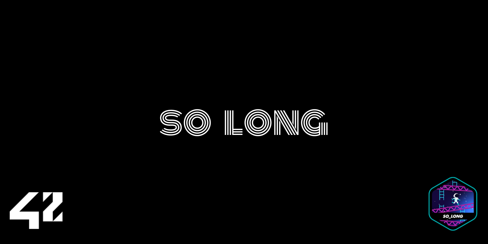

# so_long


## A 2D game in C
So_long is a 2D game, written in C, in which the player must eat all the collectables in the given map and, only after all the collectables were eaten, the player may go through the exit and finish the game.

## Usage
```
make run
```

## Map
You can write any map you like, saving it in the 'maps' folder and using the '.ber' extension.<br />
1 - Wall (the player can not go through it);<br />
0 - Empty space;<br />
P - Player;<br />
E - Exit;<br />
C - Collectable.

## Controls
The player can be controlled using the keyboard's arrow keys or the W, A, S, and D keys.

## Closing the game
The game is closed when you win it or by pressing the ESC key or by clicking in the (x) in the top corner of the window.

## Using minilibx
This game was written to run in a Linux system.<br />
In order to run the game, the minilibx for linux must me included in the 'libs' folder.<br />
You can get the minilibx for linux in [here](https://github.com/42Paris/minilibx-linux).
